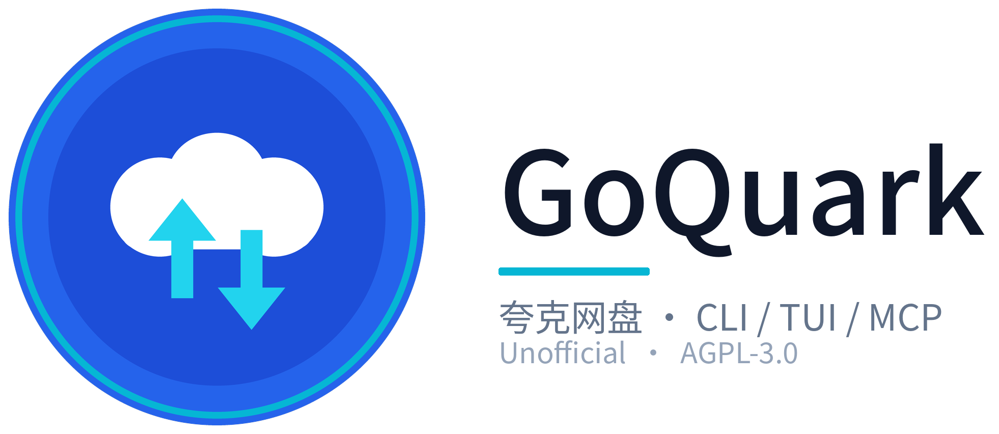
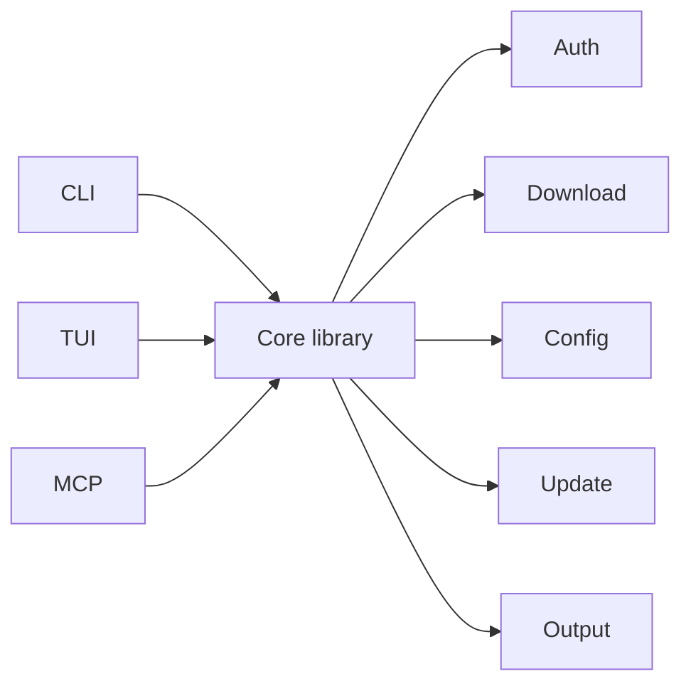

# GoQuark

[中文](README.md) · English

<p align="center">
  
</p>

<p align="center">
  <strong>Unofficial</strong> CLI / TUI / MCP client for Quark Drive (夸克网盘)
</p>

<p align="center">
  QR login · Fast download · Interactive browser · Agent-ready
</p>

<p align="center">
  
  
  
  
</p>

---

## What is it?

GoQuark is a **Go** client for Quark cloud drive, aimed at terminals and automation:

| Area | Capability |
|------|------------|
| Login | **QR code** via the Quark app |
| Download | Speed **close to the real client**; queue, pause/resume, progress & ETA |
| Browse | Terminal **TUI**: select, multi-select, context menu, download center |
| Scripts | CLI + pipe / `--json` output |
| Agents | **MCP** (stdio) for Claude Desktop, Cursor, etc. |

> **Not official.** Not affiliated with, endorsed by, or partnered with Quark, UC, Alibaba Group, or their affiliates.  
> For learning and research. Use at your own risk. See [Disclaimer](#disclaimer) and [DISCLAIMER.md](docs/DISCLAIMER.md).

---

## Features

- QR login; local device profile with customizable name  
- Multi-file downloads, download center, history  
- Pause / resume / cancel; safe shutdown on quit  
- Browse & account info (`ls` / `whoami`)  
- Terminal UI (mouse-friendly)  
- MCP tools: device, user, list, download  
- Version injected at build time (see [Versioning](#versioning))

> ⭐ If this project helps you, a **Star** would be greatly appreciated!

---

## Architecture

**CLI / TUI / MCP** share one core library.



| Module | Role |
|--------|------|
| **CLI** | Command-line entry: login, list, download, update, etc. |
| **TUI** | Interactive terminal UI: browse, multi-select, download center |
| **MCP** | stdio tools for agents (same capabilities) |
| **Core library** | Shared logic: auth, download, config, update, output |

---

## Install

**Recommended: one-liner** (downloads the right binary from [GitHub Releases](https://github.com/ButterFuture/GoQuark/releases) — **no Go install needed**):

```bash
curl -fsSL https://raw.githubusercontent.com/ButterFuture/GoQuark/main/scripts/install.sh | bash
```

Default path: `~/.local/bin/goquark` (or `/usr/local/bin` if writable). Options:

```bash
curl -fsSL https://raw.githubusercontent.com/ButterFuture/GoQuark/main/scripts/install.sh | bash -s -- --version v1.0.0
curl -fsSL https://raw.githubusercontent.com/ButterFuture/GoQuark/main/scripts/install.sh | bash -s -- --dir ~/.local/bin
```

**Or download a Release asset manually:**

1. Open <https://github.com/ButterFuture/GoQuark/releases>
2. Pick the file for your OS/arch (e.g. `goquark_*_linux_amd64`)
3. Optionally verify with `SHA256SUMS`
4. `chmod +x` and place it on your `PATH` as `goquark`

```bash
chmod +x goquark_1.0.0_linux_amd64
sudo mv goquark_1.0.0_linux_amd64 /usr/local/bin/goquark
```

After install, **start with the TUI**:

```bash
goquark tui
```

Upgrade: re-run the install script, or `goquark update --yes`.

<details>
<summary>Build from source (optional, needs Go)</summary>

See **[docs/BUILD.md](docs/BUILD.md)**.

</details>

---

## Quick start

**Preferred: TUI** (browse, download, and download center in the terminal)

```bash
goquark tui
```

First launch walks you through QR login. For most day-to-day use, stay in the TUI.

<details>
<summary>CLI usage (scripts / automation)</summary>

```bash
goquark login          # QR login (terminal + qrcode.png)
goquark device
goquark whoami
goquark ls /
goquark download /cloud/path/file.mkv
goquark downloads
goquark downloads --watch
goquark mcp
goquark version
```

</details>

| Item | Detail |
|------|--------|
| Config | `~/.config/goquark/config.json` |
| Override | `GOQUARK_CONFIG` or `-config` |
| Default download dir | `~/Downloads/GoQuark` (`download_dir` / `GOQUARK_DOWNLOAD_DIR`) |

Session cookies stay **local only**. Never commit or share a config that contains cookies.

---

## TUI (summary)

| Key | Action |
|-----|--------|
| Click / Space | Select |
| `d` | Download selection |
| `t` | Download center |
| Right-click / `m` | Menu |
| `p` / `r` / `x` / `c` | Pause / resume / cancel / clear finished (in center) |
| `q` | Quit (confirms; safely pauses active jobs) |

---

## MCP

stdio server: host runs `goquark mcp`.

1. Build and install to a fixed path  
2. Run `goquark login` once  
3. Use the **absolute path** in the host config  

### Claude Desktop

- macOS: `~/Library/Application Support/Claude/claude_desktop_config.json`  
- Windows: `%APPDATA%\Claude\claude_desktop_config.json`

```json
{
  "mcpServers": {
    "goquark": {
      "command": "/path/to/goquark",
      "args": ["mcp"]
    }
  }
}
```

### Cursor / other stdio hosts

```json
{
  "mcpServers": {
    "goquark": {
      "command": "/path/to/goquark",
      "args": ["mcp"]
    }
  }
}
```

| Tool | Description |
|------|-------------|
| `goquark_device` | Device profile |
| `goquark_whoami` | Logged-in user |
| `goquark_ls` | List path (`path`, default `/`) |
| `goquark_download` | Download (`remote`, `local`) |

---

## Versioning

| Item | Detail |
|------|--------|
| Source of truth | Root [`VERSION`](VERSION) (currently **1.0.0**) |
| Build inject | `scripts/build.sh` / CI via `-ldflags` |
| Local `go run` | Shows `dev` if not injected |

```bash
./scripts/version.sh
./scripts/build.sh
goquark version
```

Release flow: ship features → bump `VERSION` → tag `v1.0.0` → CI / Release.

---

## Tech stack

| Layer | Choice |
|-------|--------|
| Language | Go |
| TUI | Bubble Tea, Lip Gloss |
| Network | Go `net/http`, TLS |
| Agents | MCP (stdio) |
| Config | JSON under `~/.config/goquark/` |

Downloads use concurrent HTTP and a local task manager (queue, pause/resume, progress UI). Goal: **speed close to the real client**.

---

## License

Original code is **[GNU Affero General Public License v3.0 (AGPL-3.0)](LICENSE)**.

- **Attribution required** — keep the copyright and license notice  
- **Copyleft (AGPL)** — if you distribute or offer a modified version as a network service, you must provide corresponding source under AGPL-3.0  
- Third-party dependencies keep their own licenses  
- Full third-party list: [`docs/ACKNOWLEDGMENTS.md`](docs/ACKNOWLEDGMENTS.md)  

```text
Copyright (c) 2026 ButterFuture
```

---

## Disclaimer

**Read before use. Using this software means you accept the following.**

1. **Unofficial** — Not a Quark / UC / Alibaba product.  
2. **Learning / research** — Do not violate law or platform terms.  
3. **Your risk** — Account, data, privacy, membership impact, etc.  
4. **Copyright** — You are responsible for content you download or share.  
5. **AS IS** — No warranty; APIs may change; no duty to maintain forever.  
6. **Third-party libs** — Follow their licenses.  

Short form: [DISCLAIMER.md](docs/DISCLAIMER.md).

### Rights / takedown

Email: `ButterFuture@proton.me`  
Subject: `[GoQuark] Takedown / Rights Notice`  
Include: identity & contact, paths/commits, rights basis, requested action.

---

## Security

- Never paste cookies from `config.json` into chat, screenshots, or CI logs  
- Run CLI / MCP only on machines you trust  
- Verify Release checksums when installing binaries  

---


## Documentation

| Doc | Description |
|-----|-------------|
| [`docs/DISCLAIMER.md`](docs/DISCLAIMER.md) | Disclaimer |
| [`docs/CHANGELOG.md`](docs/CHANGELOG.md) | Changelog |
| [`docs/ACKNOWLEDGMENTS.md`](docs/ACKNOWLEDGMENTS.md) | Third-party licenses (compliance) |
| [`docs/README.md`](docs/README.md) | Docs index |
| [`LICENSE`](LICENSE) | Full AGPL-3.0 |

## Status

**v1.0.0** — Login, browse, TUI download center, multi-file download (pause/resume), MCP.

Planned: public release channel, optional in-app update check, broader MCP tools.

---

<p align="center">
  Made with Go · AGPL-3.0 · Unofficial
</p>
